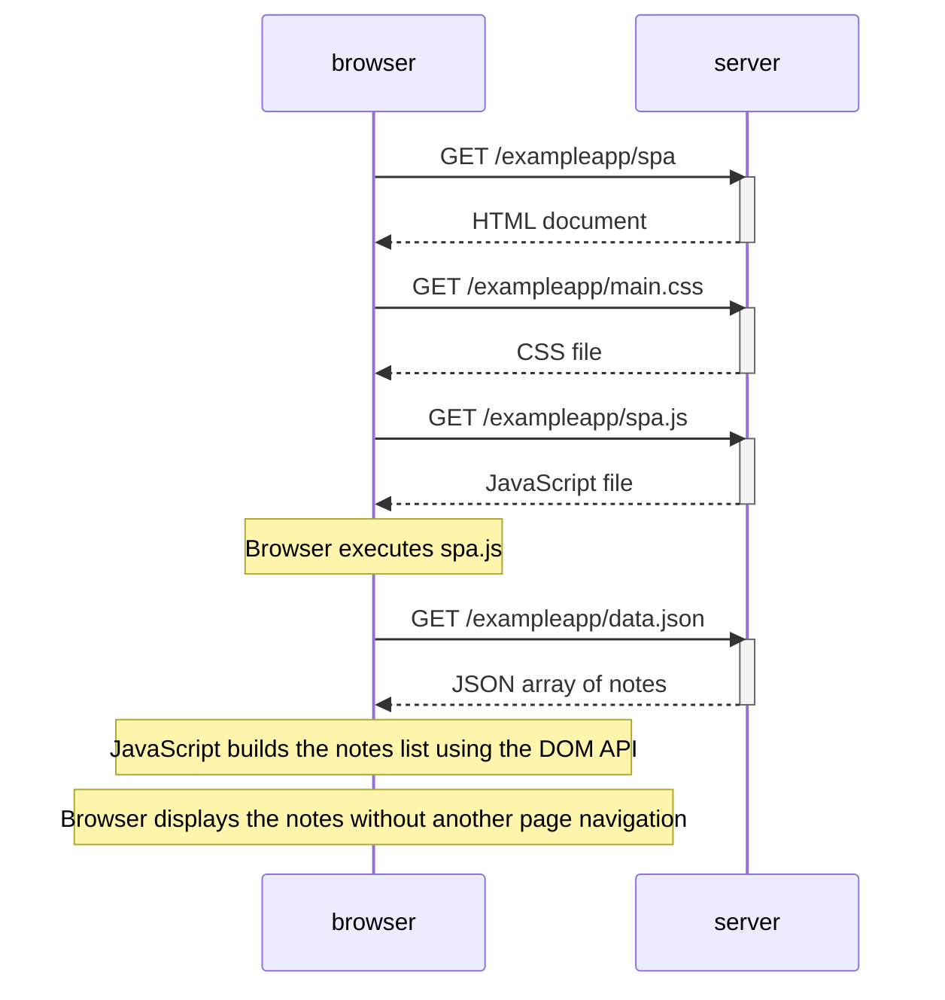

# Exercise 0.5: Single-page app diagram

```mermaid
sequenceDiagram
    participant browser
    participant server

    browser->>server: GET /exampleapp/spa
    activate server
    server-->>browser: HTML document
    deactivate server

    browser->>server: GET /exampleapp/main.css
    activate server
    server-->>browser: CSS file
    deactivate server

    browser->>server: GET /exampleapp/spa.js
    activate server
    server-->>browser: JavaScript file
    deactivate server

    Note over browser: Browser executes spa.js
    browser->>server: GET /exampleapp/data.json
    activate server
    server-->>browser: JSON array of notes
    deactivate server

    Note over browser: JavaScript builds the notes list using the DOM API
    Note over browser: Browser displays the notes without another page navigation
```

The SPA loads one HTML page and a JavaScript file. The JavaScript fetches the notes as JSON and renders them in the browser.
